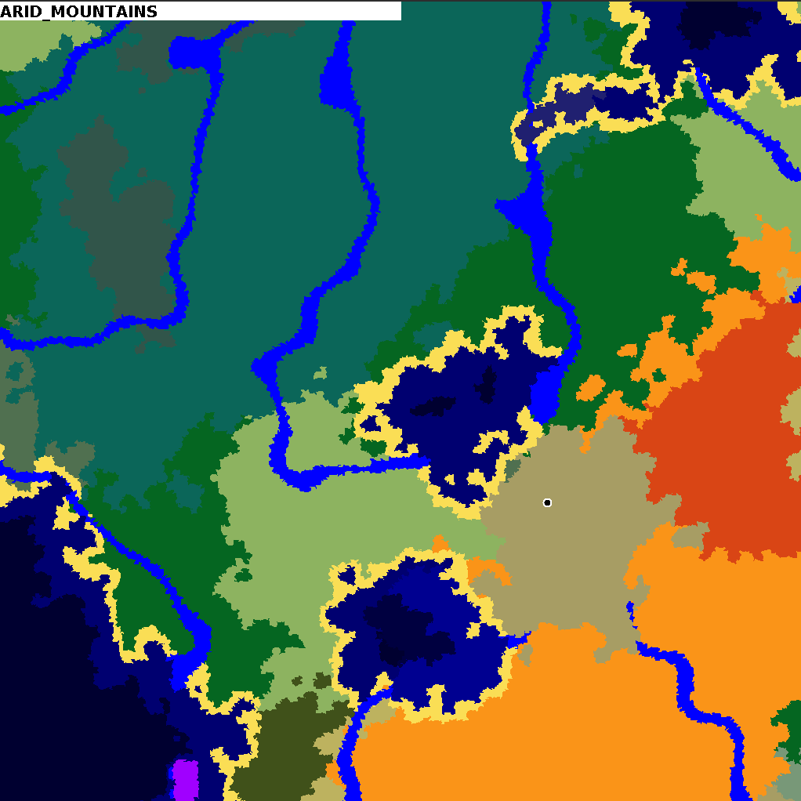

# BiomeTool
Utility for viewing biome pipelines

This utility application allows viewing large-scale images of [Terra](https://github.com/PolyhedralDev/Terra)
Biome Pipelines. It is a very helpful utility for rapid development of Terra configs.

## Download
Download the latest version from the Releases tab of this GitHub repository.

## Usage
To use the program, simply place it in a folder, and put your *entire* config pack in a
subdirectory named `pack` or in a ZIP file named `pack.yml`. Run the program and a map of
biomes will be generated based on your pack's pipeline. Biomes will be colored based on the
`color` key in the pack config.

Press `s` to randomize seed/reload the pipeline.

Click anywhere on the application window to view the biome name at that location.

